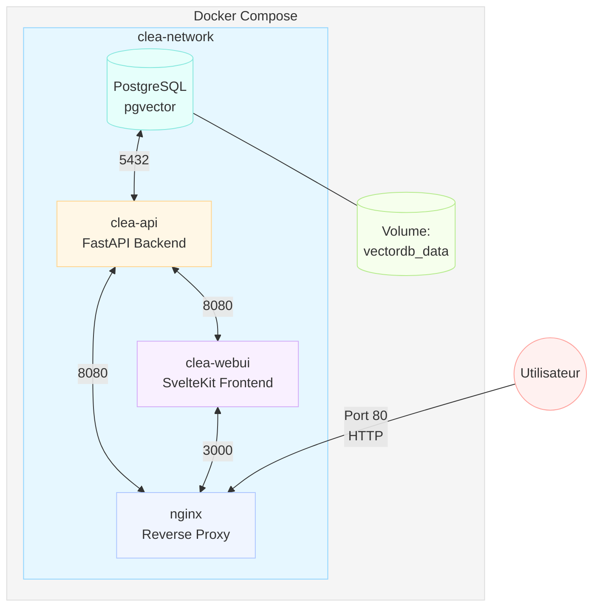

# CLÉA - Plateforme d'exploration documentaire intelligente



## Présentation

CLÉA est une plateforme complète d'exploration documentaire intelligente combinant:
- Un backend API Python pour la recherche vectorielle et le RAG
- Une interface utilisateur moderne et intuitive en SvelteKit
- Une base de données PostgreSQL avec l'extension pgvector
- Un serveur nginx pour orchestrer le tout

Ce dépôt contient la configuration Docker Compose permettant de déployer l'ensemble de la solution en quelques commandes.

## 🚀 Architecture

Le système CLÉA se compose de quatre services principaux:

- **db**: Base de données PostgreSQL avec pgvector pour le stockage vectoriel
- **api**: Backend FastAPI (clea-api) gérant l'extraction, l'indexation et la recherche
- **webui**: Frontend SvelteKit (clea-webui) offrant l'interface utilisateur
- **nginx**: Reverse proxy qui coordonne les requêtes entre le frontend et l'API

L'architecture utilise un réseau partagé `clea-network` et un volume persistant pour les données.

## ✨ Fonctionnalités

- **Chargement multi-formats**: PDF, DOCX, TXT, et plus encore
- **Recherche sémantique avancée**: Recherche hybride (vectorielle + SQL)
- **Assistant IA**: Génération RAG avec modèles locaux
- **Interface moderne**: Dashboard intuitif, explorateur de documents, visualisations
- **100% local**: Aucune dépendance cloud, traitement hors-ligne pour données sensibles
- **Orchestration complète**: Déploiement intégré via Docker Compose

## 📋 Prérequis

- Docker Engine 24.0+
- Docker Compose V2
- 8GB RAM minimum (16GB recommandé)
- 10GB d'espace disque libre
- CPU compatible avec opérations vectorielles (pour performances optimales)

## 🛠️ Installation et démarrage

### Option 1: Clone et démarrage rapide

```bash
# Cloner le dépôt
git clone https://github.com/WillIsback/Clea.git
cd Clea

# Lancer l'ensemble des services
docker compose up -d

# Vérifier que tout fonctionne
docker compose ps
```

### Option 2: Avec variables d'environnement personnalisées

```bash
# Copier le fichier d'environnement exemple
cp .env.example .env

# Éditer les variables selon vos besoins
nano .env

# Lancer avec les paramètres personnalisés
docker compose up -d
```

## 🔧 Configuration

### Ports par défaut

| Service | Port interne | Port externe par défaut |
|---------|-------------|-----------------------|
| db      | 5432        | 5432                  |
| api     | 8080        | 8080                  |
| webui   | 3000        | 3000                  |
| nginx   | 80          | 80                    |

### Variables d'environnement

Principales variables configurables dans le fichier .env:

```properties
# Configuration Docker Compose
COMPOSE_BAKE=true

# Configuration de la base de données
DB_USER=postgres
DB_PASSWORD=password
DB_NAME=vectordb
DB_PORT=5432

# Configuration des ports
API_PORT=8080
UI_PORT=3000
NGINX_PORT=80
```

## 🌐 Utilisation

Une fois démarré, accédez à:

- **Interface web**: http://localhost:80 (ou le port configuré pour nginx)
- **API directe**: http://localhost:8080 (documentation OpenAPI disponible à /docs)
- **Base de données**: accessible sur le port 5432 (utile pour administration directe)

## 📦 Structure des dossiers

```
Clea/
├── .env                      # Variables d'environnement globales
├── docker-compose.yml        # Configuration d'orchestration principale
├── clea-api/                 # Backend API Python
│   ├── Dockerfile            # Configuration de build pour l'API
│   ├── .env                  # Variables spécifiques à l'API
│   └── ...
├── clea-webui/               # Frontend SvelteKit
│   ├── Dockerfile            # Configuration de build pour le frontend
│   ├── nginx/conf.d/         # Configuration nginx pour le frontend
│   └── ...
└── README.md                 # Ce fichier
```

## 🔍 Surveillance et maintenance

### Logs des services

```bash
# Suivre tous les logs
docker compose logs -f

# Suivre les logs d'un service spécifique
docker compose logs -f api
```

### Redémarrer un service

```bash
docker compose restart webui
```

### Mise à jour des images

```bash
docker compose pull
docker compose up -d --build
```

## 🛡️ Sécurité et confidentialité

- Toutes les données restent en local (rien n'est envoyé vers des services externes)
- CLÉA est conçu pour fonctionner en environnement air-gapped (sans internet)
- Les modèles d'IA sont exécutés localement
- Aucun tracking ni télémétrie

## 🤝 Contribution

Les contributions sont les bienvenues! N'hésitez pas à:

1. Forker le projet
2. Créer une branche (`git checkout -b feat/nouvelle-fonctionnalite`)
3. Commiter vos changements (`git commit -m 'Ajout: nouvelle fonctionnalité'`)
4. Pousser vers la branche (`git push origin feat/nouvelle-fonctionnalite`)
5. Ouvrir une Pull Request

## 📄 Licence

Distribué sous licence MIT. Voir `LICENSE` pour plus d'informations.

## 📚 Documentation complémentaire

- [Documentation CLÉA API](https://github.com/WillIsback/clea-api)
- [Documentation CLÉA WebUI](https://github.com/yourusername/clea-webui)

---

Développé avec ❤️ pour faciliter l'exploration documentaire intelligente.